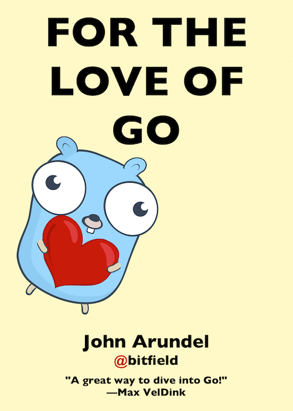

# For the Love of Go: Data


Hello, and welcome to learning Go! It's great to have you here.

## What's this?

This is a set of introductory exercises in Go programming, suitable for complete beginners. If you don't know anything about Go yet, or programming, but would like to learn, you're in the right place! It will help if you have some experience in writing tests in Go, and if you'd like to find out more about that first, try the [For the Love of Go](https://bitfieldconsulting.com/books/love) book.

(If you do already know something about Go, you should find these exercises relatively straightforward, but still worth doing.)

## Is there an ebook to accompany these exercises?

Absolutely. [For the Love of Go](https://bitfieldconsulting.com/books/love) is a downloadable ebook which guides you through every step of the process, from installing Go to explaining Go's basic data types, struct types, slices, and so on. It will guide you through solving each of these exercises in detail.

[](https://bitfieldconsulting.com/books/love)

You don't need to buy the book to work through these exercises, though it'll definitely help! But if you do buy it, you'll be helping support me and my work, including developing new exercises and books, and mentoring people from non-traditional backgrounds to help them into tech and software development careers. Which would be amazing! You can also [sponsor me on GitHub](https://github.com/sponsors/bitfield).

## What you'll learn

In this set of exercises, you'll learn:

* What we mean by 'data' and why it's so important in programming
* All about Go's built-in data types
* How to define and use structured data types using the `struct` keyword
* How to work with collections of data using _slices_
* How to store and retrieve data by key using Go's _map_ type

Because we'll be building a real software project, you'll also learn a few useful techniques that we can use for _all_ programs, not just Go:

* How to write _user stories_ to guide the design of a project
* How to prioritise your user stories using a _Minimum Viable Product_ (MVP) strategy

## How to do the exercises

Each exercise is described in a separate section of this README file. Each section briefly explains what the exercise is about, and outlines what you'll be doing. There'll be one or more goals for you to achieve, marked with **GOAL:** in bold. (Don't worry if you're not sure how to do it. There'll usually be some helpful suggestions following the goal description.)

If you're finding the goals easy, or want a bit more of a challenge, there are some _stretch goals_, too. These are optional; if you're not interested or not ready to tackle them, just skip over them.

So let's get started!

# 1: Happy Fun Books


Welcome aboard! It's your first day as a Go developer at Happy Fun Books, a publisher and distributor of books for people who like cheerful reading in gloomy times. You'll be helping to build our new online bookstore using Go!

First, let's talk a little about _data_ and _data types_. By 'data', we really just mean some piece of information, like the title of a book, or the address of a customer. So can we distinguish usefully between different _kinds_ of data?

Yes. For example, some data is in the form of text (like a book title). We call this _string_ data, meaning a sequence of things, like "a string of pearls", only in this case it's a sequence of characters.

Then there's data expressed in numbers, like the price of a book; let's call it _numeric_ data.

There's also a third kind of data which consists of 'yes or no', 'true or false', 'on or off' information. We call this [_boolean_ data](https://en.wikipedia.org/wiki/Boolean_algebra), after the mathematician George Boole, who worked out a lot of the theory for dealing with it.

So what are "data types"? The word "type" in programming means what you think it means, but with a special emphasis. It means "kind of thing", but in a way which allows us to automatically make sure that our programs are working with the right kind of thing. For example, if we declare that a certain variable will only hold string data (we say the variable's _type_ is `string`), then the Go compiler can check that we didn't accidentally assign a number to it.

Let's distinguish first between a _value_ (a piece of data, for example the string `"Hello, world"`), and a _variable_ (a name identifying a particular place in the computer's memory which can store some specific value).

Values have types; the type of `"Hello, world"` is named `string`. So we call this a _string value_, because it's of _type `string`_. A variable in Go also has a type, which determines what values it can hold. If we intend it to store string values, we will give it type `string`, and we refer to it as a _string variable_.

So a string variable can hold only string values. That's straightforward, isn't it? Make sure you feel comfortable in your understanding of types, values, and variables before continuing.

**GOAL:** Create a new folder in this repo. Write a Go program in it that declares a variable of a suitable type to hold the name of a book's author. Assign it the name of your favourite author. Print out the value of the variable.

**GOAL:** Add a variable to your program to represent the current edition number of the book: first edition, second edition, and so on. Assign it a suitable value.

# 2: Structural Engineering


Here at Happy Fun Books, we deal in many different kinds of data. Books are one obvious example: a book has various kinds of information associated with it, including the title, author, price, ISBN code, and so on. In our online store, we'll also need to deal with data about customers (name, address, and so on), and orders (which customers have ordered which books, for example).

Instead of dealing with each piece of book data separately, as we did in the previous chapter, we'd prefer to deal with a 'book' as a _single_ piece of data in the system, so that we can (for example) pass a 'book' to a function, or store it in some kind of database.

A data type made up of several values that you can treat as a single unit  is called a _composite_ type (as in, "composed of several parts"). One of the most useful composite data types in Go is called a _struct_, short for 'structured data'.

A struct groups together related pieces of data, called _fields_. For example, a struct describing a book might have a string field for the title, and a `bool` field to say whether or not it's currently in stock (or perhaps an `int` field for the number of copies in stock).

Each of these fields has names, so that we can reference them individually. Here's a definition of a simple `Book` type:

```go
// Book represents information about a book.
type Book struct {
	Title  string
	Author string
	Copies int
}
```

**GOAL:** Write a Go program which defines the type `Book`, as given here, then declares a variable of type `Book`, assigns it a value, and prints out the value of the variable.

**STRETCH GOAL:** Add suitable fields to the `Book` struct to represent a book that is a member of a series. For example, this book is the second in a series called "For the Love of Go". How would you represent that? Your solution should make it possible to list a book series in order, for example.

Since we can't afford to give these books away (much as we'd love to), they'll need a price, too. To eliminate currency issues, let's assume the price is always in the same currency (dollars, for example).

There are excellent reasons, which we won't go into here, why you shouldn't use floating-point values to represent money, so let's make the price an integer field which represents the price in a whole number of _cents_, rather than dollars.

Here's the updated definition of the `Book` struct, with the `PriceCents` field added:

```go
// Book represents information about a book.
type Book struct {
	Title      string
	Author     string
	Copies     int
	PriceCents int
}
```

**GOAL:** Extend your Go program to add a price to your `Book` literal, and add a new field `DiscountPercent` to the `Book` struct declaration, representing a percentage discount (for example, `DiscountPercent: 10` would represent a 10% discount off the cover price). Add a suitable value for this field to the struct literal assigned to the `b` variable. Print out your book information in a suitable format for a book catalog, including price and discount data.

**STRETCH GOAL:** Write a function `NetPrice` which takes a `Book` value, including price and discount information, and returns the net price of the book with discount applied. Add this data to your book catalog output.

**TRY:** Suppose you declare a certain field in a struct (for example, `Edition int`, representing the edition number of the book), but then you don't supply a value for that field in your struct literal. What happens? Can you refer to that field of the variable? What value does it have? See if you can guess the answer before trying it out in your program. Try omitting the value for various different field types. What value do they get if you don't explicitly assign one?

# 3: Slicing & Dicing


We're pretty close to being able to start work on our bookstore project, but there's something we're still missing. We can create a single value of the `Book` type and assign it to a variable, but a decent bookstore is going to need more than one book. We don't yet have a way of dealing with _collections_ of things (books, for example).

## Slices

Just as we grouped a bunch of values of different types together into a struct, so that we can deal with them as a unit, we would like a way to group together a bunch of values of the _same_ type. In Go this kind of type is called a _slice_ (it's a slightly weird name, I know, but just roll with it for now).

For example, a value representing a group of books would be a _slice of `Book`_ (that's how we say it). We write it using empty square brackets before the element type: `[]Book`. Just as each individual `struct` type in Go is a distinct type, so is each slice.

Can we declare variables of a slice type? Yes, we can:

```go
var catalog []Book
```

Just as with any other Go type, this says "Please create a variable named `catalog` of type 'slice of `Book`'".

We've seen how to write struct literals; is there such a thing as a _slice literal_? Yes:

```go
catalog = []Book{}
```
**GOAL:** Write a Go program that declares a variable of type `[]string`, assigns it a slice literal of strings, and prints it out.

**STRETCH GOAL:** Some books have multiple authors (for example, Strunk and White's "The Elements of Style"). Modify your `Book` struct to allow it to store information about multiple authors for the same book. A slice of strings might be a good choice of data type!

There's something else we can do with a slice that we couldn't do with our other types: we can _add a new element_ to it. We use the built-in `append` function for this:

```go
b := Book{ Title: "The Grapes of Mild Irritation" }
catalog = append(catalog, b)
```

**GOAL:** Extend your Go program to add a `catalog` variable of type `[]Book`, assign it a slice literal of books, and then append one book to it.

**STRETCH GOAL:** Write a function `AddToCatalog` which takes a book as a parameter, and adds it to the catalog using `append`.

Nifty! This sounds like just what we need for our bookstore. The only thing missing is being able to _iterate_ (that is, do something repeatedly, once for each element) over a slice of books. How can we do that?

The `for ... range` statement will do exactly that for us. Here's what it looks like:

```go
for i := range catalog {
    fmt.Println(i, ": ", catalog[i].Title)
}
```

In fact, it's so common to want the element at position `i` that Go can supply it for you automatically, without you having to refer to `catalog[i]` inside the loop. We can do this by 'receiving' _two_ values from the `range` statement instead of just one:

```go
for i, b := range catalog {
        fmt.Println(i, ": ", b.Title)
}
```

Now `i` is the index value, as before, and `b` is the _element value_, that is, the `Book` value at position `i`. If we don't happen to need the index value at all, just the element, we can use the _blank identifier_ `_` to ignore it:

```go
for _, b := range catalog {
        fmt.Println(b.Title)
}
```

Since iterating over slices is very common in Go programs, and we usually don't care about the index value, just the element, you'll see this kind of construction a lot.

**GOAL:** Extend your Go program to loop over all the books in your catalog, printing out the author and title of each book. Finally, have it print out the number of books in the catalog.

**STRETCH GOAL:** Add a boolean field `Featured` to your `Book` struct, to identify books which are featured as 'Pick of the Month' for special display. Write a function `FeaturedBooks` which returns a slice of `Book` containing only the books in the catalog which are featured.

# 4: Breaking Ground


So, you just learned about a few of Go's basic data types, and how to use structs and slices, and you think you're ready to start building an online bookstore? I've got some great news for you: you absolutely are!

As you know, the _package_ is Go's way of organising chunks of related code. With most projects, there's some kind of _core_ package which implements the most basic functionality relating to the problem we're solving. We might layer other packages on top of that, such as an API or a web application, or a command-line tool, and we might add other packages 'below' it, like a database layer to store persistent data. But it makes sense to start with the core package. What should we name it?

A single word is best, ideally a short word, and one that completely describes what the software is for. Let's call our core package `bookstore`.

There's usually some data type which is central to our core package; it's the thing that the whole project is about. In our case, that would be `Book`. So let's think for a minute about our core `Book` type. What fields does it need to be useful in a bookstore application?

All books have a title (even George Jean Nathan's "A Book Without a Title"), and let's assume they also have an author (maybe you!). Let's also include a description field to tell people what it's about, and an integer `PriceCents` field so they know how much it costs.

If you've read the first book in this series, [For the Love of Go: Fundamentals](https://bitfieldconsulting.com/books/fundamentals), you'll know that we'll be using a test-driven development (TDD) workflow. If you _haven't_ read that book, and you're new to testing in Go, I recommend you go and read it now, because it'll be really helpful for what's coming next.

TDD means writing a test _before_ writing any production code, so we seem to have a problem right away: we know we want a core `Book` type in our `bookstore` package, but how can we create one if we're not allowed to write any production code yet?

Let's write a test which can't pass unless our `Book` type exists with the fields we decided on. Here's one (in the file [`bookstore_test.go`](bookstore_test.go)):

```go
package bookstore_test

import (
    "bookstore"
    "testing"
)

func TestBook(t *testing.T) {
	_ = bookstore.Book{
		Title:       "Spark Joy",
		Author:      "Marie Kondō",
		Description: "A tiny, cheerful Japanese woman explains tidying.",
		PriceCents:  1199,
	}
}
```

We have a `go.mod` file identifying the `bookstore` module, and a [`bookstore.go`](bookstore.go) containing a `package bookstore` declaration, so the import should work. But we know that the `Book` struct isn't yet defined, so we should see a compilation failure when running the test.

If we run `go test` now, that's exactly what we see:

```
# bookstore_test [bookstore.test]
./bookstore_test.go:9:6: undefined: bookstore.Book
FAIL    bookstore [build failed]
```

**GOAL** Make this test pass.

**STRETCH GOAL:** Extend your test to include all the various `Book` fields we've discussed in previous chapters (multiple authors, discounts, series membership, pick of the month, and so on). Make the extended test pass.

# 5: Marauding Maps


Let's implement our first MVP user story for the bookstore: listing all books. Suppose we implement this with a function called `GetAllBooks`. How shall we write a test for it?

Virtually all tests in Go follow a structure like this:

1. Decide beforehand what you _want_ to get from calling the function with a given input.
2. Call the function and compare what you _want_ with what you _got_.

So, what's our `want` here? That's easy: given a catalog of books—a _slice_ of `Book`—the `GetAllBooks` function should return exactly that slice.

But we don't have a catalog yet. Let's create one in the simplest way that could possibly work: adding a slice variable to package `bookstore`:

```go
var Catalog = []Book{}
```

Each test needs to know something about the 'world' in which it's running; usually, by setting up that world itself. So for `TestGetAllBooks`, we might set up the world as follows:

```go
book1 := Book{Title: "This is Book 1"}
book2 := Book{Title: "This is Book 2"}
bookstore.Catalog = []Book{book1, book2}
```

Now we have some books for `GetAllBooks` to return. And we also know our `want`; it's just `bookstore.Catalog`. So the return value from `GetAllBooks` (which clearly doesn't need to take any parameters) should be exactly equal to that.

There's just one problem. Usually in a test we compare `want` with `got`, to see if it was as expected. But we can't actually compare two slices in Go using the `==` operator:

```
invalid operation: want != got (slice can only be compared to nil)
```

The standard library function [`reflect.DeepEqual`](https://golang.org/pkg/reflect/#DeepEqual) can do this comparison for us, but there's an even better solution. There's a package called [`go-cmp`](https://github.com/google/go-cmp) which is really clever at comparing all kinds of Go data structures, and it's especially useful for tests.

You're now ready to write the test for `GetAllBooks`!

**GOAL:** Write `TestGetAllBooks`. Now write `GetAllBooks` so that the test passes.

**STRETCH GOAL:** Write a test for a function `AddBookToCatalog`, which takes a `Book` value and adds it to the catalog. The test should verify that the book is in the catalog after the function has been called. Make the test pass.

Not too difficult, was it? In fact, it's _so_ easy that you might wonder if it's worth having a `GetAllBooks` function at all; we could just refer to `bookstore.Catalog` instead!

Well, let's see what happens when we try to write the test for the second user story: viewing a book's details. Our `want` here will probably be some kind of formatted string, like this:

```
Title: Right Ho, Jeeves
Author: P.G. Wodehouse
Description: ...
```

And let's call the function that produces this string `GetBookDetails`. What input should it take? Well, that's a bit of a puzzle, isn't it? How do we uniquely identify a particular book? Not by its title, because there are many books with the same title. Clearly not by its author, price, or any of the other fields on `Book`. There is such a thing as an International Standard Book Number (ISBN), but not every book has one; this one doesn't, for example!

So we're going to need some unique identifier (ID) for each book. Let's use a string, rather than a number, for flexibility. (ISBNs, for example, can contain not just digits, but also the letter `X`, weirdly enough.)

**GOAL:** Update your `TestBook` function to add a string `ID` field to the Book literal, and then update the `Book` struct definition so that this test passes.

**STRETCH GOAL:** Write a test for a function `NewID` which returns a string that can be used as a book ID. Every time you call the function it should return a different strings, though it doesn't matter what the strings actually _are_ (and the test should make no assumptions about them other than that they're unique). You should generate at least ten IDs and none of them should be the same as any other. Make this test pass by implementing the `NewID` function. (There are many ways to solve this problem, and you can use whichever one you like. If it passes the test, it's correct, by definition.)

Now that we have unique IDs for books, we're in a better position to write `TestGetBookDetails`.

**GOAL:** Decide what format you want the book details to take, and write `TestGetBookDetails` so that it checks the result from the function against this expected output. Write a minimal `GetBookDetails` implementation which just returns an empty string so that you can compile the test, and see it fail.

Now it should be relatively easy to write the real `GetBookDetails` function. If we had the `Book` value corresponding to the ID, we could use `fmt.Sprintf` to construct a details string from its fields. But how can we find the book in the catalog that has the ID we want?

**TRY:** Think about this a little and see if you can work out a way to do it, before reading on. It doesn't have to be a _good_ way; this is a minimum viable product, after all. We just need to get the test passing.

Well, the simplest way that could possibly work is to iterate over every book in the slice using `for ... range`, checking its ID to see if it's the one we want. It's not elegant, or scalable, but it'll work for now.

**GOAL:** Implement `GetBookDetails` as quickly and simply as possible.

**STRETCH GOAL:** Write a test for, and implement, a function `GetAllByAuthor` which takes a string identifying an author, and returns all the books in the catalog by that author (including the cases where the author is one of multiple authors of the same book).

**STRETCH GOAL:** Write a test for a function `GetCatalogDetails` which uses both `GetAllBooks` and `GetBookDetails` to produce a string containing information for all the books in the catalog. Make the test pass.

A successful bookstore, though, will have lots of books, and it'll take a long time to search through all of them checking all their IDs. Can't we do better?

What we want is a data structure that, given a book ID, returns the corresponding book directly, without looping. It would take the form of a _mapping_ between IDs and books, or to put it another way, a map of IDs _to_ books.

It turns out that Go has exactly the data type we want! And, for reasons that may now be clear to you, it's called a _map_.

**GOAL:** Refactor the `bookstore` package and its tests to use a map for the catalog, instead of a slice.

**STRETCH GOAL:** To make it easy to find books by author, add a map to the `bookstore` package which relates author's names to book IDs. For example, the entry for `Charles Dickens` might contain the book IDs corresponding to `Nicholas Chuckleby`, `Easy Times`, and `A Christmas Pudding`. Update your `AddBookToCatalog` function so that it updates this author index as well as adding the book to the main catalog. Extend your tests to cover this functionality.

## Going further

You have nearly everything you need now for your bookstore MVP, except payments. Here are some challenges you might like to try tackling on your own. If you feel up to implementing some of them, go ahead! If you're not that confident yet, you might like to just think about them, make some notes, and try to figure out how it _might_ work. You can always come back to these challenges later.

### Payments

Assume you have available some third-party payment processing service which, given a book ID and a price, returns either `true` (payment succeeded) or `false` (payment failed for whatever reason). Write a dummy implementation of this service for testing purposes, which can either succeed or fail on demand, depending on what the test needs.

Use it to design a test for a `BuyBook` function, and implement the function. Return a suitable message to the user according to whether the payment succeeded or failed. You'll need a way to have that function use the dummy payments service when you call it from the test, but some (currently hypothetical) real service when it's called in _production_, that is to say, in your real live bookstore. What would this look like? (The technical term for this is _dependency injection_, which sounds painful, but it really just means "passing in the thing you need".)

### Orders

Assuming the payment succeeds, we need to do something that actually causes the book to get shipped to the user (or they won't be too happy). Think about this problem. What could we do? It will probably be useful to create some kind of `Order` value that identifies the book and the customer who bought it. Assume that once an `Order` is created in the system, this will trigger the shipping somehow (maybe somebody just lists the unfulfilled orders every morning, and processes them). There's a lot of fun design work for you to do here, and it definitely involves data!

### A user interface

It may not have escaped your notice that, while you've developed a useful core engine for managing the bookstore, there's as yet no way for customers (or staff) to actually interact with it. What would an MVP user interface look like? What are we still missing that we'd need before we can take orders?

This doesn't need to be a web-based application (you could take orders by phone or email, for example, and have the bookstore staff use some kind of command-line tool to process them). What would that look like? What would a web-based bookstore look like?

You know how to design these things now: by writing user stories, using an MVP to prioritise them, and by building the functionality test-first. Use what you've learned to make Happy Fun Books a reality! And be happy and have fun yourself.

## Who wrote this?

[John Arundel](https://bitfieldconsulting.com/about) is a Go teacher and mentor of many years experience. He's helped literally thousands of people to learn Go, with friendly, supportive, professional mentoring, and he can help you too! Find out more:

* [Learn Go with mentoring](https://bitfieldconsulting.com/golang/learn)

## Has it been published as a friendly, low-priced ebook?

Yes. You can buy the book, which covers all the exercises in much more detail, including a complete step-by-step guide to solving them, here:

* [For the Love of Go](https://bitfieldconsulting.com/books/love)

## Mailing list

If you'd like to hear about it first when I publish new books, or even join my exclusive group of beta readers to give feedback on drafts in progress, you can subscribe to my mailing list here:

* [Notify me about new books](http://eepurl.com/hdYV0z)

## Further reading

You can find more Go tutorials and exercises here:

* [Go tutorials from Bitfield](https://bitfieldconsulting.com/golang)

I have a YouTube channel where I post occasional videos on Go, and there are also some curated playlists of what I judge to be the very best Go talks and tutorials available, here:

* [Bitfield Consulting on YouTube](https://www.youtube.com/c/BitfieldConsulting)

## What's next?

You might like to try another set of exercises in this series:

* [The G-machine](https://github.com/bitfield/gmachine) guides you through the development of a simplified virtual CPU in Go, complete with its own machine language. Along the way you'll learn some useful computer science fundamentals.

## Credits

Cover image by Andy Pearson, of [London Parkour](https://londonparkour.com/).

'Structure' image by [Giorgiogp2](https://commons.wikimedia.org/wiki/User:Giorgiogp2), licensed under [Creative Commons](https://creativecommons.org/licenses/by-sa/3.0/deed.en).

Gopher images by the magnificent [egonelbre](https://github.com/egonelbre/gophers).
